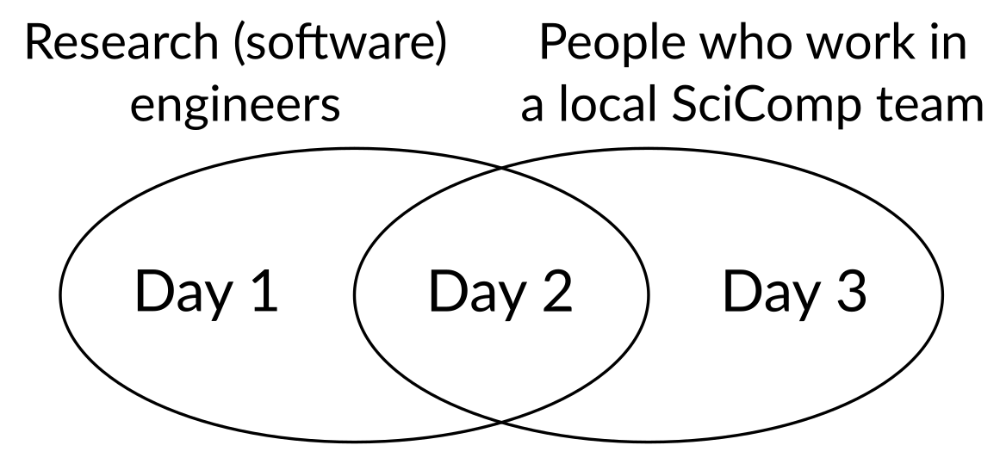

Nordic Basic Scientific Computing 2026
======================================

.. toctree::
   :hidden:

   finnish-rse-meetup
   scicomp-team-meetup

.. toctree::
   :hidden:
   :caption: Information

   practical-info
   registration
   about

.. toctree::
   :hidden:
   :caption: Program

   call-for-sessions
   schedule

Nordic Basic Scientific Computing is a gathering of everyone
interested in supporting scientific computing (and a celebration of
the diverse work that makes it all possible).  Aalto Scientific
Computing invites to its homebased at Otaniemi Campus, 2-4
February 2026.

**The first half is a** :doc:`Finnish+friends RSE meetup
<finnish-rse-meetup>` **, the second half is a** :doc:`meetup of Finnish
scientific computing teams more targeted to service staff
<scicomp-team-meetup>`\ **.  The overlapping middle day has events
that are interesting to both audiences.  People are welcome to attend
both halves.**

	 and "People who work in a local SciComp team" on the right,
	 with day 1, 2, and 3, with day 2 overlapping.

This isn't a time to advertise how great we are.  It's a time to look
under the hood and talk about what's really going on, so that we can
do a better job in the future.  If your job is "getting stuff done"
instead of "publishing papers" and you want to learn from like-minded
people, this is the meeting for you.

Schedule (general plan)
-----------------------

.. seealso:: :doc:`schedule`

* Day 0 (Su, 1 Feb 2026): If anyone arrives early, grilling dinner in a Finnish forest (if enough people want to brave the cold).
* Day 1 (Mo, 2 Feb 2026): RSE meetup
* Day 2 (Tu, 3 Feb 2026): RSE/SciComp overlap day: events, lunch, evening dinner, some social activities scattered between.
* Day 3 (We: 4 Feb 2026): SciComp team meetup: events 9-12, lunch.

Quick info
----------

.. seealso::

   :doc:`practical-info`

**Location:** Dipoli, Otaniemi Campus, Aalto University, Espoo, Helsinki area, Finland

**Price:** Free

:doc:`registration`: To be opened later.

Online attendance: We’ve chosen to hold this event in person only, as
we believe it offers the best environment for meaningful networking
and a more engaging, collaborative atmosphere.

Key dates:

* 1 December: Registration opens (closes when full)
* (ongoing) Rolling acceptance of talks (posters, demos, other
  contributions?)
* 7 January: First submission deadline, voting on talks begins (all
  relevant talks accepted, length will be decided later by voting).
* 20 January: Talk length decided (latest)
* 2-4 February: NoBSC

Registration
============

  We will provide
long times for coffee breaks and lunches and make sure that everyone
can find an engaging group to be a part of.

The event is intended to be relatively small to facilitate networking.

Online attendiance will probably be possible, but we havn't set it up
yet.

.. admonition:: Registration link

   Not yet opened.

