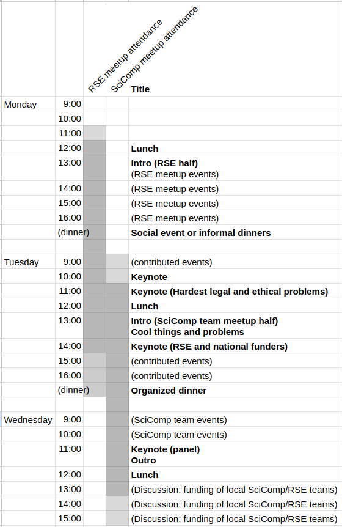

Schedule
========

When to attend
--------------

* **For NoBSC for service staff**, attend 3 Feb until lunch on Feb 4.
* **For the Finnish-RSE meetup**, attend lunch (or earlier) on 2 Feb
  to lunch or dinner on 3 Feb.
* The overlapping day is events of interest to both groups.
* You are of course welcome to attend more, if you would like.

Timetable
---------

Below is a draft of our schedule plan.  This is in early stages and
will be improved later (including making it not a spreadsheet
screenshot).

